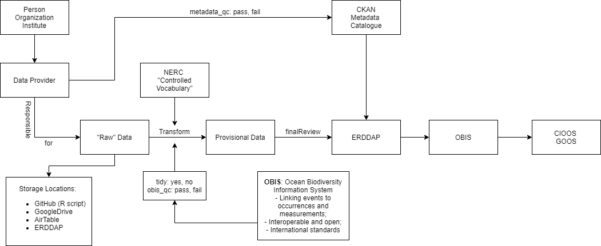

---
output:
  html_document:
    df_print: paged
  fig_caption: yes
  'includes:':
    in_header: figure_opts.tex
    latex_engine: xelatex
  rmarkdown::pdf_document: null
  word_document: default
  pdf_document: default
sansfont: Times New Roman
fontsize: 12pt
header-includes:
- \usepackage{booktabs}
- \usepackage{sectsty} \sectionfont{\centering \emph}
author: "Tim van der Stap"
date: "7/24/2020"
---


```{r, include = FALSE}
knitr::opts_chunk$set(echo = FALSE, message = FALSE)
library(here)
library(tidyverse)
library(hakaiR)
options(scipen=999) # This removes scientific notation for inline output ie `r object` in the report text
```

# Data Management Plan
## _Salmon ecological data_

`July 24, 2020`

`Tim van der Stap`

`Hakai Institute`

`1713 Hyacinthe Bay Road, Heriot Bay, BC, Canada`

# Executive Summary

This Data Mobilization and Communication Plan describes the data mobilization work flow applied to format data sets to an international standard, and comments on the various steps taken in the process. To adhere to the open and FAIR data principles, data is standardized to an international standard using controlled vocabulary, ensuring interoperability between other databases worldwide and sustainability of the data long-term. Standardized terms (controlled vocabulary) are used to describe values, methodology, units and measurement types in the (meta)data. A relational database structure is used to visualize the (federated) approach taken. Adopting international standards such as OBIS and the FAIR data principles that are widely recognized, and applying them to Essential Ocean Variables, will ensure a multilateral approach to the standardization of (historic) salmon ocean ecology data. 

# List of acronyms

Below the acronyms mentioned throughout this Data Mobilization and Communication Plan and their descriptions are listed for reference. 

BODL - Biodiversity of Life Online Database
CKAN - Comprehensive Knowledge Archive Network
DMP - Data Management Plan 
DwC - Darwin Core
ERDDAP - Environmental Research Division Data Access Program
CIOOS - Canadian Integrated Ocean Observing System
GBIF - Global Biodiversity Information System
GOOS - Global Ocean Observing System
MBON - Marine Biodiversity Observation Network
NERC - Natural Environment Research Council
OBIS - Ocean Biodiversity Information System
ONC - Ocean Networks Canada
TDWG - Biodiversity Information Standards (formerly: The International Working Group on Taxonomic Databases)
WoRMS - World Register of Marine Species

# Introduction 

This Data Mobilization and Communication Plan ('DMCP') aims to describe the work flow and the federated approach taken by the Hakai Institute to standardize salmon ecological data to international standards. Improving the understanding on how the (historic) data collected is standardized, mobilized and what model structure it follows will hopefully provide a 'support base' or strengthen the foundation for scientists to collaborate and engage. The approach described in this report can be applied to various scientific disciplines within salmon ecology, but is especially useful for environmental and occurrence data. A brief description of the standardization process is provided and how version control is implemented. 

It is important to note that this is a living document, and as we move forward hopefully this process of data standardization will become more streamlined, resulting in a higher quality data and faster data processing. Ultimately we aim to achieve active collaboration, engagement and feedback from scientists on the data process and output, improving the data quality. 

## Data principles

The Hakai Institute believes that successful data science depends on how standardized and integrated the collected data is, and how accessible the data is. Therefore, it is important that the data is 'open source' data and follows the 'FAIR' data principles: Findable, Accessible, Inter-operable, and Reusabl (Tanhua et al. 2019). Open source data allows version control and collaboration between scientists, with the idea being that data collection procedures, statistical analyses and data output will be of greater quality. To achieve this a need arose for an international standard. By formatting - we often refer to it as 'tidying' or 'data wrangling' - the data to an international standard, the interoperability of the data is improved as it becomes easier to search and filter for the correct data, and longevity of the data as well, as more data starts following international standards. Additionally, it allows data to be reused by future scientists and organizations. 

TRUSTed data. 

# Objectives

When it comes to standardizing data, the goal is to ensure that the data adheres to the FAIR data principles and is therefore inter-operable between different platforms. The data that we have been working with has predominantly been salmon ecological data which contains, among other things, environmental and occurrence data, collected during the International Year of the Salmon (IYS) project. 

To standardize data it is important that we create an effective Data Mobilization and Communications model which describes how standardization is achieved, what we are working toward and what the key components within this framework are. This model or framework that is being built will hopefully contribute to a stronger foundation among the scientific community and strengthen the idea that (international) collaboration and quality or version control are required to improve quality and data science. The objectives of this Data Mobilization and Communication Plan are three-fold: 

1. Describe the federated approach taken to standardize data;
2. Describe how it complies with the principles of open and FAIR data; 
3. Visualize the relational database structure

A relational database structure model is created to visualize the work flow used and to describe the various steps taken in the process to standardize data to an international format. Finally, it is argued how this process of data standardization will be beneficial to the database of historic salmon diet data. 

# Data standards, platforms and software used

Currently, the raw data we receive regarding the IYS project is stored on Google Drive, in a secure folder that is only accessible for people involved. A Google Drive folder was set up to hold data for the short-term. To receive data more efficiently, a Data Submission Google Form and a static Word document were created to accurately capture metadata. Established communications with scientists ensure that the data that is being transformed is a finalized version. Additionally, scientists provide metadata accompanied with the data that will be used to describe the 'raw' data. It is important to note that this 'raw data' is typically data that has already been cleaned by the scientists and can already be used by them for analyses. When transforming data to international standards, _no changes are made to the raw data directly_. The data sets provided are finalized. **Brett, are we moving to separate ERDDAP server to host this data on, to which the scientists have access as well, allowing them to upload new versions/do version-control themselves?**

The statistical software program _R_ is used to wrangle the data, with the initial goal of hosting the standardized data on ERDDAP. ERDDAP is a data server that allows for a consistent way to download subsets of scientific datasets. Over time, different scientific communities have developed different types of data servers. ERDDAP unifies the different types of data servers so you have a consistent way to get the data in the format you want. The R script or code for data transformation is stored in a publicly accessible GitHub, a version-control platform. Data is transformed to the international standard in such as way as that it is compatible with ERDDAP. 

While ERDDAP is an excellent platform to host various data on, it is not specific to ocean observations. This Data Management and Communications model will be founded on protocols and standards for archiving and providing open access to data put forward by the Global Ocean Observation System (GOOS). GOOS is a program that is coordinated by the Intergovernmental Oceanographic Commission of UNESCO (United Nations Educational, Scientific and Cultural Organization). GOOS is partnered with expert agencies in biological data-namely the Ocean Biodiversity Information System (OBIS), the Barcode of Life Database (BOLD) and the Marine Biodiversity Observation Network (MBON). These organizations promote and/or develop the use of _Controlled Vocabularies_. Standards like this encourage interoperability and reuse of data. We recommend using established international standards connected to GOOS where available, and extending or developing standards where needed. These controlled vocabularies define Essential Ocean Variables (EOVs), methods, units and measurement types that are typically used in salmon ocean ecology adhering to 'Ocean Best Practices', maintained by GOOS. 

OBIS can extract the data from the ERDDAP platform, ultimately connecting the data to other data sets hosted on e.g. GOOS or CIOOS. CIOOS is the Canadian Integrated Ocean Observation System, which bring together and leverages existing Canadian and international ocean observation data into a federated data system (Stewart _et al_. 2019), with the goal of improving connections between end users and the data providers of ocean observations, maximizing the overall benefit of integrated observing. CIOOS has been developed in line with the Global Ocean Observing System (GOOS) framework, in particular the use of Essential Ocean Variables (EOVs) as discussed in the Framework on Ocean Observing (Lindstrom et al., 2012) and with an eye to future inclusion of the currently developing Ecosystem and Biodiversity EOVs (Miloslavich et al., 2017; Muller-Karger et al., 2018). This 'federated' approach for data storage means having a record in the metadata catalogue that sometimes points to the data in an externally established and certified repository that we don't maintain. Because we aim for the data to be inter-operable with other data sets hosted on CIOOS or GOOS, we transform the data with the 'language' used in OBIS. 

By formatting the data and data columns to an international standard and having all datasets follow a similar structure, it simplifies the process of searching for the data in the future. To ensure that people search for the correct terms, OBIS promotes the use of a standardized set of terms, also known as _controlled vocabulary_ in both the metadata and to label the data. This also enables records to be interpreted by computers, and opens up data sets to a whole world of possibilities for computer aided manipulation, distribution and long term reuse. The controlled vocabulary we use comes from the Natural Environment Research Council (NERC) Vocabulary Server. The NERC Vocabulary Server provides access to lists of standardized terms that cover a broad spectrum of disciplines of relevance to the oceanographic and wider community. It gives scientists the means to access lists of controlled terms to describe data, saving time trying to unravel data sets. Controlled vocabulary is used to describe e.g. sampling methodology, measurement units and values, and is therefore applied to both the data and the metadata.

Metadata associated to the data set is currently hosted on the Comprehensive Knowledge Archive Network (CKAN), following DFO/CIOOS. CKAN is a Data Catalogue that centralizes data access through a web portal, and the metadata hosted here is compliant with ISO 19115, making the data sets broadly discoverable across the federated system. Our CKAN web portal is password protected. Through CKAN a link will also be provided to the standardized data. The metadata catalogue will be accessible to the scientists that provided the data. Quality control will have to be done for all metadata uploaded to CKAN. Quality control for the metadata will be done through engagement with the Data Provider, whereas the quality control for the standardized data will be done internally, with the Data Provider and with OBIS, to ensure that the standardized data meets the requirements set out by OBIS. The data hosted on OBIS will feed into GOOS / CIOOS. 

By ensuring that our standardized data meets the requirements set out by OBIS, it will be inter-operable and connected with other data sets hosted in GOOS. OBIS is a global open-access data and information clearing-house on marine biodiversity for science, conservation and sustainable development. The Darwin Core (DwC) is the body of standards for biodiversity standards used in OBIS. It provides terms and vocabularies used to format data to an international standard. This 'archive' of terms and vocabularies (thus often referred to as Darwin Core Archive or DwC-A) is maintained by TDWG (Biodiversity Information Standards, formerly The International Working Group on Taxonomic Databases). As the name implies, OBIS is an excellent platform to host biodiversity data, which typically consists of occurrence or presence/absence data. Additionally, OBIS can also host environmental data (OBIS-ENV-DATA). Using this approach, and standardizing both biological as well as environmental data according to the DwC-A so that it can be hosted on OBIS, allows for biological and environmental data to be linked through a common 'event', i.e. a parentEvent (see e.g. De Pooter et al. 2017). 

Data standardized to DwC terms typically follows a hierarchical structure, where usually three layers - or 'Cores' - are created through which the data is linked: the Event Core, Occurrence Core and the extended MeasurementsOrFacts (eMoF) Core. Each of these layers contains different data pertaining to the sampling event, the occurrence or the measurements. A detailed description of this structure can be found here: https://obis.org/manual/darwincore/. Through unique, shared IDs the different cores are nested.  

# Visual representation of relational database structure

The diagram below summarizes the federated approach taken when standardizing data, and indicates how the different platforms and steps are connected. 



# Case study - historical salmon diet data

By standardizing and formatting the data and the database according to DwC-A standards we can ensure that moving forward, the data complies to the FAIR data principles. This approach can be applied to near real-time data collected, future data and also historic data. This would allow even greater findability, accessibility and interoperability with other platforms and data worldwide. Adding historic salmon diet data provides a very valuable opportunity to integrate salmon ecological data throughout the years, and by standardization allows it to be compatible and inter-operable to other data sets collected throughout the Northeast Pacific, whilst simultaneously increasing the sustainability of the data and database. Any future salmon diet data collected in the NE Pacific can then also more easily be integrated into the established database. ]

# Moving forward

Moving forward, if this federated approach and work flow is agreed upon, I recommend applying the approach to a subset of the historic salmon diet data. Currently both the historic salmon diet database and the transformation scripts are found on a public GitHub. Whilst the transformation scripts are data-specific, they do given an idea as to the approach taken and how time-consuming the standardization would be. Additionally, it would provide further insight of the work flow. 

# Conclusion

Integrating the historic salmon diet database with the Hakai Institute's approach to formatting data to an international standard, as per OBIS / DwC, would increase the sustainability and interoperability of the historic salmon diet data with other salmon ecology data collected throughout the NE Pacific. The process of standardization would also ensure that the data would adhere to the FAIR Data principles. The Data Mobilization and Communication Model provided here offers a framework for how and why data standardization is important. Moving forward, it is recommended that a small subset of the historic salmon diet data be standardized to improve understanding of the process and gain an insight as to how time consuming it is. 

# Important links and resources

- OBIS: https://obis.org/ -- https://obis.org/manual/
- NERC Vocabulary: https://www.bodc.ac.uk/resources/products/web_services/vocab/
- GitHub IYS Hakai: https://github.com/HakaiInstitute/iys-oos
- De Pooter, D., Appeltans, W., Bailly, N., Bristol, S., Deneudt, K., Eliezer, M., ... & Lipizer, M. (2017). Toward a new data standard for combined marine biological and environmental datasets-expanding OBIS beyond species occurrences. Biodiversity Data Journal, (5).
- Stewart, A., Deyoung, B., Smit, M., Donaldson, K., Reedman, A., Bastien, A., ... & Plourde, A. (2019). The development of a Canadian integrated ocean observing system (CIOOS). Frontiers in Marine Science, 6, 431.
