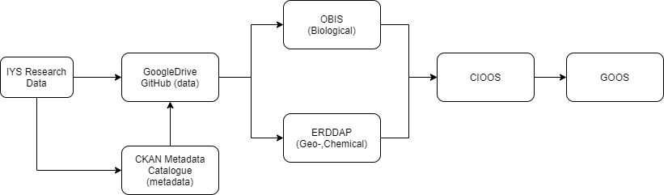
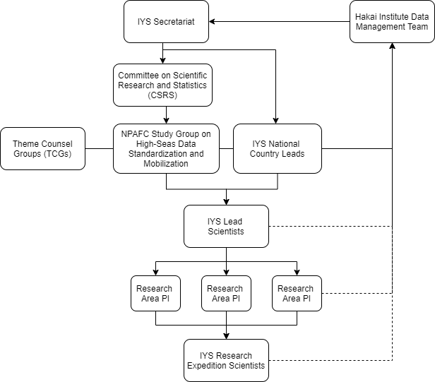

---
output:
  rmarkdown::pdf_document:
    fig_caption: yes
    includes:
      in_header: figure_opts.tex
    latex_engine: xelatex
  pdf_document: 
  toc: true
  toc_depth: 2
sansfont: Times New Roman
fontsize: 12pt
header-includes:
- \usepackage{booktabs}
- \usepackage{sectsty} \sectionfont{\centering \emph}
---

```{r, include = FALSE}
knitr::opts_chunk$set(echo = FALSE, message = FALSE)
library(here)
library(tidyverse)
library(hakaiR)
options(scipen=999) # This removes scientific notation for inline output ie `r object` in the report text
```

# _International Year of the Salmon Data Mobilization and Communication Plan_

`Hakai Institute`

`Tim van der Stap, Brett Johnson`

`1713 Hyacinthe Bay Road, Heriot Bay, BC, Canada`

`Last Updated:` `r Sys.time()`

# Executive Summary

This Data Mobilization and Communication plan describes the evolving workflow applied by biological data scientists to format data from the series of ‘International Year of the Salmon’ associated fisheries and oceanography research cruises to international standards. The proposed approach can be applied to various scientific disciplines within the IYS project, and the data standardization, mobilization and integration are highlighted. Additionally, various critical components in the core IYS Data Mobilization digital infrastructure are described that support the standardization process. To adhere to open and FAIR data principles, data are standardized to an international standard using controlled vocabulary, ensuring longevity of the data and interoperability with the multitude of data that fall under the GOOS umbrella. A federated approach is used to integrate existing standards where community practice adopts them. Adopting international standards, such as DwC-A, and applying them to Essential Ocean Variables identified by GOOS, will ensure a multilateral approach to the standardization of salmon ocean ecology data collected. A proposed communication scheme is presented on how to effectively communicate this data mobilization and standardization approach throughout the IYS project, and improve and ensure understanding, collaboration and engagement with the research scientists involved. 

## Acronyms

Below is a list of the acronyms mentioned throughout this Data Mobilization and Communication plan and their description. 

* CKAN - Comprehensive Knowledge Archive Network
* DMAC - Data Management and Communication plan
* DwC(-A) - Darwin Core Archive
* ERDDAP - Environmental Research Division Data Access Protocol
* CIOOS - Canadian Integrated Ocean Observing System
* FAIR – Findable, Accessible, Interoperable, Reusable
* FRDR - Federated Research Data Repository
* GOOS - Global Ocean Observing System
* IPT - Integrated Publishing Toolkit
* IYS ( - OOS) - International Year of the Salmon (Ocean Observation System)
* MBON - Marine Biodiversity Observation Network
* NERC - Natural Environment Research Council
* NPAFC - North Pacific Anadromous Fish Commission
* OBIS - Ocean Biodiversity Information System
* ONC - Ocean Networks Canada
* TDR – Trustworthy digital repositories
* TDWG - Biodiversity Information Standards (formerly: The International Working Group on Taxonomic Databases)
* TRUST – Transparency, Responsibility, User focus, Sustainability and Technology
* WoRMS - World Register of Marine Species

# 1. Introduction 

The North Pacific Anadromous Fish Commission (NPAFC) is implementing a five-year International Year of the Salmon (IYS) collaborative project through 2022 to set the conditions for the resilience of salmon and people in a rapidly changing world. This Data Mobilization and Communication plan (hereafter referred to as ‘DMAC’) aims to describe the current approach taken to standardize, mobilize and integrate data collected during the IYS research cruises, and includes ideas on how to streamline this process moving forward, bridge gaps between the scientific domains of salmon ocean ecology, and increase collaboration and engagement efforts with scientists. 

Improving understanding of how salmon ocean ecology data are standardized, mobilized and how the data are integrated in the Global Ocean Observing System (GOOS) framework should strengthen the foundation for scientists to collaborate and engage to deepen the impact of their work. The approach described in this report can be applied to various scientific disciplines within salmon ecology, but is especially useful for biological, geological, chemical, and physical data that relate to Essential Ocean Variables (EOVs) as identified under each of the three domains in the GOOS framework (see section 4.1). The majority of the data collected during the 2019 research expedition is centralized in the International Year of the Salmon Ocean Observation System (IYS-OOS) repository. Through active collaboration and engagement with scientists throughout the data mobilization process, we strive to improve the quality of the (meta)data, and deepen the impact of research through transdisciplinary data integration. 

This document is initially created for internal use between the Hakai Institute, the IYS Secretariat, the NPAFC Study Group on High Seas Data Standardization/Mobilization (‘Study Group’) and the National Lead Scientists. Once finalized, it can be distributed to Principal Investigators (PIs) and IYS Expedition Scientists (see section 3) to improve understanding of the data mobilization process and the communication workflow adopted. It outlines the rationale behind choosing for specific platforms, digital repositories and frameworks, and their associated data principles. 

## 1.1 FAIR Data principles

Successful science depends on how standardized, integrated and accessible data are. Therefore, it is important that the data are open source and follow the FAIR data principles: the data should be Findable, Accessible, Interoperable, and Reusable (Tanhua et al. 2019). 

Findable: Data and supplemental materials need to have sufficiently rich metadata and a unique and persistent identifier. 
Accessible: Metadata and data are understandable to humans and machines. Data are deposited in a trusted, secure repository. 
Interoperable: Metadata use a formal, accessible, shared and broadly applicable language for knowledge representation.
Reusable: Data and collections have clear usage licenses and provide accurate information on provenance. 

Open source data are data that can be freely used, shared, and built-on by anyone, anywhere and for any purpose. Having open data allows for version control and collaboration between scientists, improving data collection procedures, data recording, statistical analyses and the quality of the data output. By integrating/re-formatting - often referred to as 'tidying' or 'data wrangling' - the IYS salmon ocean ecology data to an international standard, the interoperability is improved as it becomes easier to search and filter for the correct data in various data repositories, increasing both the longevity and reusability of the data. Ensuring the data is interoperable allows building upon prior work, accelerating results and improving access to specialized knowledge, ultimately improving the credibility and reproducibility of the data collected. 

## 1.2. TRUST Principles for Digital Repositories

The FAIR data principles highlight the need to embrace good practice by defining essential characteristics of data objects to ensure data longevity and reusability. To make the data comply with the FAIR data principles whilst ensuring their longevity requires trustworthy digital repositories (TDRs). To demonstrate trustworthiness, a set of guiding principles has been created. Transparency, Responsibility, User focus, Sustainability and Technology: the TRUST principles, provide a common framework to facilitate discussion and implementation of best practices in digital preservation (Lin et al., 2020). The TDRs selected throughout the data mobilization process have been selected based on their ability to meet the TRUST principles, which in turn also makes the data more findable and accessible.

## 1.3. DMAC Objectives

The salmon ocean ecology data collected during the IYS research expeditions contain, among other things, both physical and biological data. Throughout the standardization workflow, the goal is to ensure that the data adhere to the FAIR data principles and are hosted on trustworthy digital repositories, being interoperable with other platforms, and allowing for trans-disciplinary data integration within salmon ocean ecology data. 

The objectives of this DMAC are three-fold: 

1. Describe the proposed data infrastructure scaffolding, and how it complies with the FAIR data principles and the TRUST principles for digital repositories (section 2.1); 
2. Provide a brief overview of current data standardization, mobilization and integration processes (section 2.2);
3. Describe the next steps in deepening the impact of IYS salmon ocean ecology research through a proposed communication plan (section 3)

Additionally, recommendations are provided on how to improve the data mobilization and communication approach taken (section 4). 

# 2. Methods

This DMAC is supplemental to the International Year of the Salmon Data Mobilization Strategic Recommendations report, and addresses in more detail the operational component of the standardization workflow. A brief overview of the proposed data cyberinfrastructure is given to provide a framework for the standardization workflow approach.

## 2.1 Cyberinfrastructure 

This DMAC is founded on the protocols and standards for archiving and providing open access to data in the framework as established by the GOOS. Some of the core objectives of the GOOS are, among others, to set the global standards and best practices for ocean-related data collection, curation, and mobilization. Curation in this context is synonymous to standardization. Expert agencies are partnered with the GOOS in biological data, including the Ocean Biodiversity Information System (OBIS) and the Marine Biodiversity Observation Network (MBON). These organizations promote and develop the use of standardized terminology (“controlled vocabularies”). Adopting international standards encourages interoperability and reusability of data. Another benefit of this approach is the reproducibility of analyses, especially where repetitions of ‘naturally observed experiments’ are not possible. The GOOS focuses on distinct Essential Ocean Variables (EOVs) within three domains: Physical & Climate, Biogeochemistry, and Biology & Ecosystems. The EOVs, identified by the GOOS Expert Panels, are data elements that are determined to have a high impact and feasibility, and assessments of these ensure that the best, most cost-effective plan is adopted across platforms to obtain data. Furthermore, in July 2019 GOOS, partnering with the International Oceanographic Data and Information Exchange (IODE) adopted the ‘Ocean Best Practices System’ (OBPS) as a project under the Intergovernmental Oceanographic Commission (IOC). Controlled vocabulary is applied to the methods, units, values and sampling protocols that are defined under the EOVs used in salmon ocean ecology and which also adhere to the ‘Ocean Best Practices’.  

Our current practice is that we publish completed data sets provided by scientists in a trustworthy digital repository that adheres to the TRUST principles, and extract core data elements (EOVs) to further standardize data to a format that is supported by the 'language' used by OBIS and GOOS. Biological datasets and their metadata are published to OBIS using the Integrated Publishing Toolkit (IPT), and physical and geochemical datasets are published to ERDDAP. The Canadian Integrated Ocean Observing System (CIOOS), which follows the same syntax as GOOS, extracts the data from these repositories, and as the data have been standardized to a language that is supported by GOOS, the salmon ocean ecology data can feed into GOOS and is interoperable with the multitude of datasets under the GOOS umbrella. In other words, it makes the data easily and, more importantly, scientifically comparable with other data that have adopted these international standards.

## 2.2. Data Standardization Workflow

By reformatting the (meta)data to an international standard and having all datasets follow a similar structure, this makes the data more findable and accessible in the future. To ensure that people search for the correct terms, OBIS, like GOOS, promotes the use of a standardized set of terms in both the metadata and to label the data. This also enables records to be machine-readable, and opens up data sets to a whole world of possibilities for computer aided manipulation, distribution and long-term reuse. This approach must take into account ethical, legal, and scientific merits of sharing knowledge often complicated by differences in cultural systems of knowing. As the IYS is an international collaboration between Russia, Japan, South Korea, Canada and the US, it is imperative that the roles and responsibilities, data management practices, licensing and data provenance are clearly outlined. Conforming or adhering to an internationally agreed standard for data recording and data storage can significantly increase the data usage. 

The IYS salmon ocean ecology data we receive pertaining to a specific scientific discipline are currently stored in Google Drive, in a secure folder that is only accessible for people involved. Established communications with scientists ensure that the data that are being formatted are the final version. If changes were made to the data directly before transforming data to international standards, these changes were recorded in a changelog. Preference is given to not make any changes to the data input (‘raw’ data) directly, and instead code any changes so the data input remains intact. 

The statistical computing language R and various package libraries are used to quality check, and curate data, with the initial goal of hosting the standardized data on ERDDAP, OBIS or FRDR. As CIOOS/GOOS extracts the salmon ocean ecology data from these data repositories, the data have to be formatted to the international standard of OBIS with DwC-A at the core prior to hosting. OBIS is typically used to host biological and occurrence data (e.g. trawl records), whereas ERDDAP is a platform used for physical data (e.g. nutrients, POM) (Figure 1). Common data access protocols allow for meta searches among select data repositories. The R and Python scripts of data transformation code are stored in a publicly accessible repository. 

The Darwin Core (DwC) is the body of standards for biodiversity in OBIS. DwC provides terms and vocabularies used to format data to an international standard. This 'archive' of terms and vocabularies (thus often referred to as Darwin Core Archive or DwC-A) is maintained by TDWG (Biodiversity Information Standards, formerly The International Working Group on Taxonomic Databases). Aside from hosting biodiversity data, OBIS can also host environmental data (OBIS ENV-DATA). Using this approach, and standardizing both biological as well as environmental data according to DwC-A so that it can be hosted on OBIS, allows for biological and environmental data to be linked (see e.g. De Pooter et al. 2017). By standardizing and formatting the data according to DwC-A standards we ensure that the data are interoperable and reusable. This approach can be applied to near real-time data collected, future data and also historic data.

In the process of salmon ocean ecology data standardization, controlled vocabulary is applied to both the data and the metadata. OBIS’ recommended controlled vocabulary comes mostly from the Natural Environment Research Council (NERC) Vocabulary Server. NERC provides access to lists of standardized terms that cover a broad spectrum of disciplines of relevance to the oceanographic and wider community. It gives scientists the means to access lists of controlled terms to describe data, saving time trying to unravel data sets. Furthermore, as OBIS is mainly centered around ocean biodiversity data, any species occurrences in the data are provided with a URN from e.g. the World Register of Marine Species (WoRMS). 

Perhaps more important than the data itself is the associated metadata. Sufficiently rich metadata is required to make the data findable, accessible and improve accountability. Well in advance of the expedition, the metadata associated with each science-discipline has to be provided. This will also help identify every data element, method, platform, and variable that Expedition Scientists play to collect as well as identify the benchmarks of data mobility to aim for. Metadata associated with the data is supplied by the research scientist or data provider and available 2019 IYS metadata is currently hosted in a catalogue (IYS-OOS, https://iys.hakai.org) on the Comprehensive Knowledge Archive Network (CKAN). CKAN centralizes data access through a web portal, and the metadata hosted here is compliant with ISO 19115, making the data sets broadly discoverable across the federated system. Standardized metadata facilitates discovery and the navigation of search results. Our CKAN is a private and secure web portal. Through CKAN a link will also be provided to the standardized data. The metadata catalogue will be accessible to the scientists that provided the data. Ad-hoc quality control for the metadata is currently done through engagement with the data provider, whereas the quality control for the standardized data will be done internally, with the data provider and with OBIS, to ensure that the standardized data meets the requirements set out by OBIS, thereby ensuring that the standardized data will interoperable and connected with other data sets hosted in the GOOS.

\hfill\break

  
Figure 1. Conceptual flowchart describing the different data platforms or repositories used throughout the proposed  data mobilization process. Discipline-specific metadata associated with the IYS data is stored in a CKAN metadata catalogue, which includes links to the standardized data stored in GoogleDrive or GitHub. Standardized biological data will be hosted on OBIS, whereas physical and geochemical data will be hosted on ERDDAP.  

In the metadata it is essential that roles are assigned to both people and organizations that are the responsible party (RP) or the point of contact (POC) for the resource (data provided). A definition of the ISO roles that can be assigned under both point of contact and responsible party is provided in Table 1 below. Having the correct metadata information is essential prior to hosting data in a trustworthy digital repository. In our current set up, only a single role can be assigned to a person or organization. 

Table 1. Roles that can be associated with the responsible party and point of contact

# 3. Proposed Communication Scheme 

A clear and well-defined communication scheme is essential to having an organized workflow throughout the IYS project. We propose that initially, communication regarding the data mobilization and communication process will be done between the Hakai Institute, the IYS WG Secretariat, the National Lead Scientists, and the NPAFC Study Group on High Seas Data Standardization/Mobilization (‘Study Group’), created ad hoc by the Committee on Scientific Research and Statistics (CSRS) (NPAFC, Doc. 1926). Additionally, it is recommended that the Theme Counsel Groups (TCGs) aid in mobilizing data and should therefore also be included in initial communications ( ). 

Data mobilization, standardization and integration processes of the 2019 and 2020 datasets will identify key areas of attention, any current roadblocks, and help develop discipline-specific data mobilization and communication plans for the 2022 High Seas Expedition. Through initial communications, we further aim to address uncertainties and incorporate feedback regarding the data mobilization and standardization approach. After finalizing the standardization process, a presentation will be given to the Lead Scientists involved in the upcoming research cruise, with a case study that highlights the workflow for both biological as well as chemical or physical data. A finalized document on the data mobilization and standardization process can then be distributed to the principal investigators (PIs) and cruise scientists within each Research Area by the Lead Scientists (Figure 2). 

To demonstrate the mobilization and standardization approach for biological data, we recommend using a subset of historic salmon diet data to format to international standards and host on OBIS. A subset of historic salmon diet data was mobilized and integrated into OBIS to determine the process for integrating disparate, heterogeneous datasets that remain relevant today. The salmon diet data can be particularly useful for this, as essentially it can be regarded as ‘occurrence’ data, i.e. which species occurred in the stomach content of the salmon caught. The metadata associated with the data will be hosted on our IYS-OOS CKAN repository and in a ‘parent’ record on OBIS. In addition to demonstrating the standardization process for biological data, hosting the historic salmon diet data on OBIS will also provide an excellent case example of how our approach can be used to ‘rescue’ and integrate historic data with the salmon ocean ecology data collected during the IYS research cruises, thereby ensuring interoperability and longevity of the data.  The data mobilization process for physical or geochemical data will be demonstrated using e.g. chlorophyll or CTD data collected during the 2019 or 2020 IYS High Seas Expedition. 
<br>
 


Figure 2. Proposed communication flowchart. Initial communication on finalizing the data mobilization and integration process will be done between the Hakai Institute, IYS WG Secretariat and the identified IYS National Lead Scientists (solid lines). Once finalized, it will be communicated down the chain, giving IYS Lead Scientists, PIs and research scientists the opportunity to provide feedback and ask discipline-specific questions regarding the process to the Hakai Data Management Team (dashed line). 

A critical first step in data mobilization and integration is ensuring that we have correct metadata that clearly outlines the data provenance and roles and responsibilities. Proper metadata is required to ensure data reproducibility, accountability and interoperability. In addition to communicating the data mobilization process to the research scientists through the Lead Scientists, it is also recommended to give a presentation to each IYS Research Group, as identified by the IYS Secretariat. This presentation is intended to elaborate on the data mobilization strategy chosen, the operationalization process and will allow research scientists the opportunity to ask questions. Furthermore, it will help set the stage for future communications between the Hakai Institute and scientists involved, should any questions regarding the data arise post-expedition. Active feedback and scientist’ participation and engagement will help construct and further develop the DMAC for future expeditions.

# 4. Recommendations moving forward

The Data Mobilization and Communication plan presented here is an evolving process, and collaboration and engagement with the IYS secretariat, the National Lead Scientists and the Lead Scientists is critical to improve the standardization approach and salmon data digital infrastructure. In order to further improve the data management workflow, a recommendation is made for IYS salmon ocean ecology data to be hosted in a private repository on GitHub. This private repository would only be accessible to the responsible party (scientist, organization) and the Hakai Institute (data custodian), ensuring security of the data while simultaneously ensuring version control. 

CKAN can link to the data repository that stores the raw (unmodified) and tidied data. There are numerous advantages to using GitHub as a platform to store or host the data, over Google Drive:

Data can be stored in a private repository, accessible only to the scientist and the data custodian. 
This data repository provides version control for the data, making it very easy to see what version is the latest and what the changes are between versions. This ensures that the data wrangling is done to the latest version. 
The standardization R and Python scripts are also stored in the repository, allowing scientists to see what progress has been made on the standardization process if they so choose. 
GitHub offers a platform for communication, and questions related to the (meta)data can be asked directly to scientists tagged. 

Once the data is published by the scientists, the discipline-specific repository can be made public, thereby adhering to the FAIR data principles. 

Additionally, it is recommended that metadata entry forms or tools be created for each specific Research Group, e.g. using the Portage Network, and filled out well in advance of the 2022 High Seas Expedition, to ensure that sufficiently rich metadata will be associated with the collected data. These metadata entry tools should be created in collaboration with the Study Group and the IYS National Lead Scientists to ensure the correct information is captured.

Finally, to increase participation and understanding of the data mobilization infrastructure and standardization approach, it is recommended that this process should be discussed with the National Lead Scientists, and showcased to the scientists involved in each scientific discipline or Research Group. Using a case study, such as hosting historic salmon diet data on OBIS and demonstrating the process and application of trusted repositories can increase collaboration efforts and engagement of scientists. Perhaps a survey can be sent out to further gauge understanding or interest. It is a collaborative process, one where we aim to act as a facilitator that reduces the workload rather than adds to it. 

# 5. Conclusion

This DMAC describes the current data standardization approach of the salmon ocean ecology data collected during the IYS research cruises. Integrating and reformatting the data to an international standard increases the longevity and interoperability of the data, and ensures that the data adheres to the FAIR data principles. We must ensure that the digital repositories used to host the data follow the TRUST principles for digital repositories. Furthermore, a brief overview is provided on the current, yet evolving standardization, mobilization and integration workflow. A communication scheme is proposed on how best to distill the data mobilization and standardization process through the various layers of the IYS project. Moving forward, it is recommended that IYS salmon ocean ecology data are stored in a private, secure repository on GitHub and a presentation provided to each IYS Research Group to increase understanding, collaboration and engagement of scientists. 

# 6. Important links and resources

- OBIS: https://obis.org/ -- https://obis.org/manual/
- NERC Vocabulary: https://www.bodc.ac.uk/resources/products/web_services/vocab/
- GitHub IYS Hakai: https://github.com/HakaiInstitute/iys-oos
- GOOS Framework for Ocean Observing: http://www.oceanobs09.net/foo/
- De Pooter, D., Appeltans, W., Bailly, N., Bristol, S., Deneudt, K., Eliezer, M., ... & Lipizer, M. (2017). Toward a new data standard for combined marine biological and environmental datasets-expanding OBIS beyond species occurrences. Biodiversity Data Journal, (5).
- Lin, D., Crabtree, J., Dillo, I. et al. The TRUST Principles for digital repositories. Sci Data 7, 144 (2020). https://doi.org/10.1038/s41597-020-0486-7
- Stewart, A., Deyoung, B., Smit, M., Donaldson, K., Reedman, A., Bastien, A., ... & Plourde, A. (2019). The development of a Canadian integrated ocean observing system (CIOOS). Frontiers in Marine Science, 6, 431.
- Tanhua, Toste, Sylvie Pouliquen, Jessica Hausman, Kevin M. O'Brien, Pip Bricher, Taco De Bruin, Justin James Henry Buck et al. "Ocean FAIR data services." Frontiers in Marine Science 6 (2019): 440.
