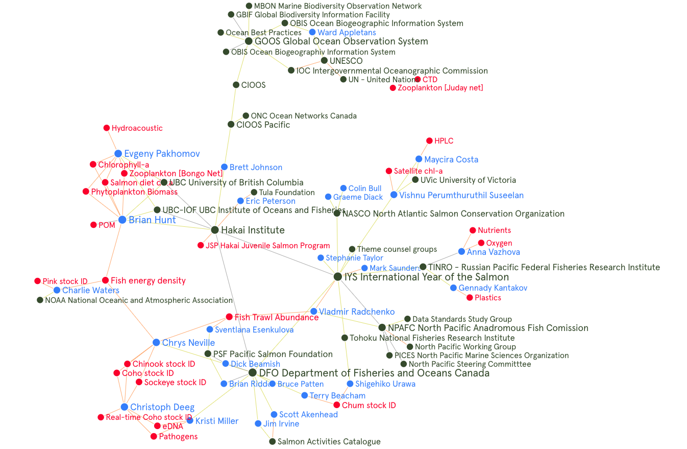

---
output:
  rmarkdown::pdf_document:
    
    fig_caption: yes
    includes:
      in_header: figure_opts.tex
    latex_engine: xelatex
sansfont: Times New Roman
fontsize: 12pt

header-includes:
- \usepackage{booktabs}
- \usepackage{sectsty} \sectionfont{\centering \emph}
      
---

```{r, include = FALSE}
knitr::opts_chunk$set(echo = FALSE, message = FALSE)
library(here)
library(tidyverse)
library(hakaiR)
options(scipen=999) # This removes scientific notation for inline output ie `r object` in the report text
```

# _International Year of the Salmon Data Mobilization Interim Report_

`March 31, 2020`

`Hakai Institute`

`1713 Hyacinthe Bay Road, Heriot Bay, BC, Canada`

# Executive Summary
An agreement was signed between the Hakai Institute and the North Pacific Anadromous Fish Commission on February 3rd, 2020 for Hakai to scope and review the requirements of data management for data collected by the International Year of the Salmon high seas research expeditions in the North Pacific. This report summarizes progress made during the 2019/20 fiscal period towards mobilizing 2019 data, and defining a Data Management & Communications Model for future expeditions. 

We recommend that the International Year of the Salmon collaborative project adopt, implement, and extend the Global Ocean Observation System for measuring Essential Ocean Variables. The Global Ocean Observation System is a project of the United Nation’s Intergovernmental Oceanographic Commission and unifies networks of scientists around the world. Adopting international standards such as the Ocean Biogeographic Information System, and FAIR (Findable, Accessible, Interoperable, Reusable) Data principles that are widely recognized will ensure a multilateral approach to the standardization of salmon ocean ecology data. 

Data collected by the 2019 research cruise is currently being processed and reviewed by expedition team members. The goal is to have data centrally accessible in an International Year of the Salmon Ocean Observation System. Our first step was collecting metadata from the expedition Scientists. Next, we aim to publish metadata records in a Catalogue which will make the datasets 'Findable'. In due time and process, datasets will be made 'Accessible' from the metadata catalogue record by providing a link to download  data. Currently, we have access to roughly half of the expedition data sets. We conducted a thorough review of the 2019 data we had access to and noted issues and missing metadata. We also developed a Dataset Submission Form for expedition data holders to upload datasets with a complete suite of metadata that describes collection protocols so critical for data integration. 

The core components of the DMAC model include: 1) a Data Catalogue that centralizes data access through a web portal; 2) Catalogue records compliant with ISO 19115 that make the datasets broadly discoverable; 3) Open-access licensing; 4) Open Data Access Protocols (OpenDAP), specifically ERDDAP data servers, where necessary and; 4) Controlled Vocabularies that define the variables, methods, units, and measurement types used in salmon ocean ecology adhering to ‘Ocean Best Practices’ maintained by the Global Ocean Observation System.

# Introduction

The North Pacific Anadromous Fish Commission (NPAFC) is implementing a five-year International Year of the Salmon (IYS) collaborative project through 2022 to set the conditions for the resilience of salmon and people in a rapidly changing world. Partners are collaborating for a Pan-Pacific Expedition in March 2021 with up to five vessels simultaneously surveying the North Pacific. Multi-disciplinary programs across at least a dozen institutions and agencies will generate a complex set of data in the 2021 surveys.  Success will ultimately demand that standardized and integrated data are available to researchers involved in the work at sea and those who will work with it into the future. It is also important that these data are open, readily accessible to all, and comply with the principles of FAIR data.  The NPAFC and the Hakai Institute with support from the BC Salmon Restoration and Innovation Fund and the Tula Foundation are conducting a review of approaches to data standardization and acquisition to support the standards, collection methods, storage, and analysis of data collected during the five-vessel survey. Brett Johnson will serve as the Technical Lead under direction from a Steering Committee and lead a small development team based at the Hakai Institute Quadra Island Ecological Observatory. The objective of this report is to summarize progress made in defining a Data Management and Communications model and consolidating 2019 Expedition data.

# Data Management and Communications Model

The proposed model will be founded on protocols and standards for archiving and providing open access to data put forward by the Global Ocean Observation System (GOOS). GOOS is a program that is coordinated by the Intergovernmental Oceanographic Commission of UNESCO (United Nations Educational, Scientific and Cultural Organization). GOOS is governed by a multinational Steering Committee, three scientific domain Expert Panels, and Observation Coordination Groups of people and organizations worldwide. GOOS is partnered with expert agencies in biological data—namely the Ocean Biogeographic Information System (OBIS), Biodiversity of Life Online Database (BOLD) and the Marine Biodiversity Observation Network (MBON), among others. These organizations promote and/or develop the use of Controlled Vocabularies. Standards like this encourage interoperability and reuse of data. We recommend using established international standards connected to GOOS where available, and extending or developing standards where needed. The product of this strategic alignment and development we can call the International Year of the Salmon Ocean Observation System (IYS-OOS) for now.

For every data element, method, platform, and variable produced by the IYS High Seas Expeditions the following tasks need to be completed:  

* Prioritize. Determine whether the data element naturally belongs in IYS-OOS (with possible GOOS BioEco extensions). Such elements will be processed first because the requirements are well-defined. For data elements that do not naturally belong in IYS-OOS, determine whether there is a recognized and compatible repository where they belong and can be federated or linked to the IYS-OOS.
* Publish. For all data elements, generate appropriate and valid metadata records and insert them into the metadata catalogue on the IYS Data Portal, so that they are discoverable by IYS users.
* Process. Work closely with the data provider to bring fully validated and standardized copies of data elements into the appropriate repositories.
* Communicate. Representatives from each scientific discipline involved with the IYS should connect through a working group that disseminates and advocates for best-practices.

# Progress 

## Data Processing

A number of datasets were delivered to Hakai from holdings that Drs. Evgeny Pakhomov and Brian Hunt had access to. A Google Drive folder was set up to hold data for the short-term. To receive data more efficiently,  a [Dataset Submission Google Form](https://forms.gle/BvMCLTGSjKsm42cS7) and a [static Word doc]("reports/IYS-GoA Dataset Submission Form.docx"). form were created to capture the accurate metadata. A number of these need to be filled out still (Table 1.) are necessary for researchers fill to out.We’ve looked through all of the 2019 data we have access to at this time, which is less than half of the expected datasets. Through this we noted issues and missing metadata for the 2019 data, so that we could get ahead in understanding gaps and challenges for the 2020 cruise.

```{r, include = FALSE}
# Go to airtable IYS-OOS 2019 Datasets to download and update this file
data_summary_2019 <- read_csv(here::here("metadata", "data_summary_2019.csv")) %>% 
  select(Dataset, Status, Contact, EOV, Notes, "GitHub Issue Tracker")

data_summary_2019 <- read_csv(here::here("reports", "data_summary_2019.csv")) %>% 
  select(Dataset, Status, Contact)

``` 


Table 1. Gulf of Alaska Expedition 2019 dataset status, and contacts as of March 31, 2020. Feedback from Chief Scientists is needed to adjust the accuracy of this table.
```{r, include = TRUE, echo = FALSE}
knitr::kable(data_summary_2019)
```

## Conferences and Meetings

### North Pacific Steering Committee

We presented the idea of using the GOOS framework first at the North Pacific Steering Committee meeting in Vancouver, BC. on February 26 and 27. We received great feedback  including consensus from everyone that the data should generally be considered 'Open'. Next was whether or not there would need to be further discussion on more specific data licenses. Modelling data access after a PICES/ICES standard was suggested and seems appropriate. Further to that, the point was brought up that we should be thinking about the legacy of these types of systems for which there was general consensus that no one wanted another database to maintain. This was an opportunity to highlight the 'federated' approach we plan to take with data storage. Federating can mean having a record in the IYS metadata catalogue that sometimes points to the data in an externally established and certified repositories. The question of when data should  be made public came up, and it was noted that some datasets will have embargo periods but that metadata could be published immediately in most cases. Lastly, the question of who will maintain the data long term was asked. A Data Synthesis centre was proposed which is one option. The development of some sort of cross-cutting community of organizations in partnership is another.

### North Pacific Working Group

We discussed the need for user stories from scientists related to sharing data. A survey for the expedition participants and others was suggested. Vladimir highlighted that the timing of the wrap-up symposium was perhaps too close to the final survey. I agree with  Vladimir's concern and I think it would be wise to view the success of this  project as the establishment of a best-practice. The demonstration of data collection, consolidation, quality control, analysis, and knowledge generation in near real-time for the symposium may only be for a subset of data, depending on the stage of standardization each research domain is able to achieve. The major highlight was the decision to propose a 1-year 'Data Standards Study Group' with participation either directly or indirectly from scientists from each country and each Research Domain identified for the 2021 Expedition. Those Research Domains include: Physical/biogeochemical Oceanography, Biological Oceanography, Modelling, Feeding Ecology and Energetics, Salmon distribution, abundance and migration, Genomics and Stock ID, and Micro plastics.

## Development of a Data Strategy

Beyond the recommendation of technical infrastructure and standards, there needs to be a long-term strategy that effectively engages important stakeholders and deepens the impact of data mobilization. This should be a primary focus of, but not limited to, the first phase of the IYS-OOS. Strategic objectives could be modelled after the GOOS 2030 strategy and include 1) Deepening Engagement and Impact; 2) System Integration and Delivery; and 3) Building for the Future.


# Network of Partners and Key Affiliates

## Steering Committee 

An executive-level steering committee will provide technical and strategic advice on the project while Hakai and NPAFC will retain administrative oversight of the project. Steering Committee participants will include:

* Eric Peterson/Brett Johnson – Hakai Institute
* Mark Saunders/Stephanie Taylor– NPAFC
* Dick Beamish and Brian Riddell – 2019 and 2020 Expeditions/Pacific Salmon Foundation
* Bruce Patten – DFO Pacific Biological Station and OBIS Canada Node Manager
* Erin Satterthwaite – GOOS BioEco Expert Panel Member
* Brian Hunt – Hakai Professor at the University of British Columbia Institute of Oceans and Fisheries
* Expedition Chief Scientists 

## Development Groups

The development of the data model will rely heavily on input from expedition Chief Scientists, Scientists, project affiliated Scientists, Professors, and others. Within each scientific domain planned for the 2021 cruise, there should be representation in an ad hoc working group tasked with determining international data standards that apply to their domain of expertise

Hakai Staff Available to consult as needed:

* Eric Peterson. Strategic direction.
* Ray Brunsting. Hakai Chief Technology Officer.
* Matt Foster. Hakai Chief Data Architect. 
* Jennifer Jackson. Physical oceanographer for Hakai.
* Brian Hunt. A faculty member at UBC and the head of Hakai salmon program



```{r, network, eval = FALSE}
library(networkD3)

# read graph commons data
nodes <- read_csv(here("data", "IYS-OOS-nodes.csv")) %>% 
  select(name = Name,
         group = Type,
         size = 1:length(ncol)) %>% 
  arrange(name)

nodes$node_id <- as.factor(nodes$name)
nodes$node_id <- as.numeric(nodes$node_id)
nodes$node_id <- nodes$node_id - 1 # zero index source and target

nodes <- nodes %>% 
  select(-size)

links <- read_csv(here("data", "IYS-OOS-edges.csv")) %>% 
  select(source = "From Name",
         target = "To Name",
         value = Weight)

source <- inner_join(links, nodes, by = c("source" = "name")) %>% 
  select(source = node_id)

target <- inner_join(links, nodes, by = c("target" = "name")) %>% 
  select(target = node_id)

source$source <- as.factor(source$source)
target$target <- as.factor(target$target)
links <- data.frame(source$source, target$target)

links$source <- links$source.source
links$target <- links$target.target

links <- links %>% 
  select(source, target)

nodes <- data.frame(nodes)

forceNetwork(Links = links, Nodes = nodes,
             Source = "source", Target = "target",
             NodeID = "name",
             Group = "group", opacity = 1,
             opacityNoHover = 1, fontSize = 12, 
             zoom = TRUE, legend = TRUE, bounded = FALSE)

```

# Road map for IYS Data Mobilization

Here is the proposed road map and timeline which will be refined before finalization for May 30, 2020.

* Produce a comprehensive Data Strategy May 30, 2020
* Begin Building Data Management and Communication Model	June 1, 2020
* Bring 2019 Cruise Data into the Correct Repository(s)	TBD	2020
* Bring 2020 Cruise Data into the Correct Repository(s)	TBD	2020
* Plan 2021 Cruise Data Management	TBD	2020
* Integrate 2019, 2020, and 2021 cruise data	TBD	2021
* Extend GOOS framework into Salmon Ocean Ecology and Integrate with Salmon Activities Catalogue	TBD	2021

# Time Sensitive Challenges

We need to better capture methods used in the field in the metadata associated with each dataset produced on the expedition. This includes platform  descriptions, equipment descriptions, calibration files, and expected key variables that will be delivered. This will help in ensuring the scientific integrity of the consolidated data sets. Dataset 'Quality' levels will be assigned based on completeness of metadata collection and integrity of provenance. Development of these guidelines is pressing and there is need to draw together specific domains to discuss these issues.

Trawl catch data has not yet been received. My current understanding indicates that the  dataset structure is under development, and that expedition Scientists are working on this. Please understand that access to raw outputs and the detailed processing steps that occur to transform data are needed for complete data provenance. Keeping track of changes to raw data is important for reproducibility, and becoming commonly required in life sciences journals despite it being a high bar to aim for. Using a change log that you maintain manually ensures that reproducibility can be achieved when data cleaning is performed ad hoc such as removing outliers during quality control procedures, etc. Otherwise, we recommend moving to using automated version control, scripted data transformations and distributed version control help scientists collaborate on common data and analyses.

Translation of data is still needed for some datasets, including Juday Net zooplankton hauls. Translators with domain specific knowledge of the data need to be identified. There are also a number of questions we have related to specific data sets that we keep track of [here](https://github.com/HakaiInstitute/iys-oos/issues) for data providers to view and respond to. We recommend the ad hoc development of data standards group ASAP. A core group comprised of representatives of each research domain (physical oceanography, salmon feeding ecology etc.) and representation from as many member nations, and stakeholders as feasible. 

# Next Steps

### Produce a Data Strategy Document that will:

* Identify project milestones for 2020, 2021, and 2022 and requisite steps to success
* Describe the foundation for a new best-practice approach to provide open and FAIR access to salmon, oceanographic, and climatic data integrated from numerous sources.
* Propose a survey of key data providers to deepen engagement.

### Begin Building Data Management & Communication Framework

Start building a data management and communication framework that initially comprises:

* A web-based IYS Data Portal. We propose to follow the lead of DFO/CIOOS and implement a cloud-based solution with Amazon Web Services, utilizing the Montreal data centre to host a data catalogue/portal.

* A metadata catalogue (we propose to follow DFO/CIOOS and employ CKAN), which allows for data discovery across the federated system.

* A GOOS-compatible repository for physical and biogeochemical data acquired on the expeditions.

* Solutions for other data types: either as natural extensions of the GOOS model, as contemplated under the GOOS Bio Eco, or in other repositories, as mandated by our modelling decisions.

* Concentrate first on the data types acquired during the 2019 cruise.

# Links and Resources

* [IYS-OOS GitHub Repository](https://github.com/HakaiInstitute/iys-oos)
* [Please comment on this document issues in github](https://github.com/HakaiInstitute/iys-oos/issues)
* [Temporary 'AirTable' IYS-OOS Database](https://airtable.com/invite/l?inviteId=invsmpqvzHUggckwg&inviteToken=53431b316c148356785d2c470a1605bc91103f8fe8189250563d929747ca2124)
* [Template CKAN Catalogue](https://catalogue.cioospacific.ca/)
* [Global Ocean Observation System](https://www.goosocean.org/)
* [OBIS ENV-DATA Darwin Core Archive Data Structure](https://obis.org/manual/dataformat/)

