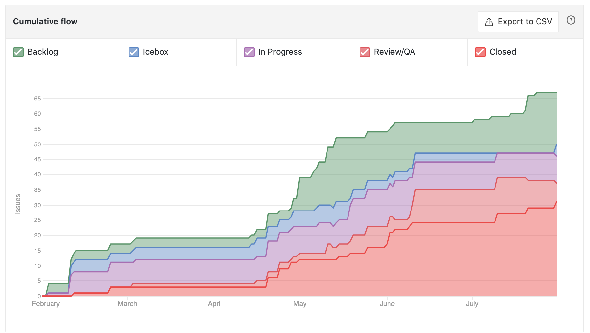
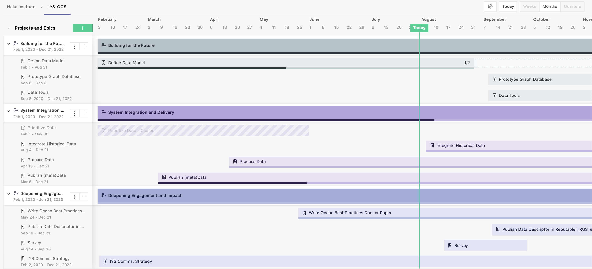

---
output:
  rmarkdown::pdf_document:
    
    fig_caption: yes
    includes:
      in_header: figure_opts.tex
    latex_engine: xelatex
sansfont: Times New Roman
fontsize: 12pt

header-includes:
- \usepackage{booktabs}
- \usepackage{sectsty} \sectionfont{\centering \emph}
      
---

```{r, include = FALSE}
knitr::opts_chunk$set(echo = FALSE, message = FALSE)
library(here)
library(tidyverse)
library(hakaiR)
options(scipen=999) # This removes scientific notation for inline output ie `r object` in the report text
```

# _International Year of the Salmon Data Mobilization Strategic Recommendations_

`Hakai Institute`

`1713 Hyacinthe Bay Road, Heriot Bay, BC, Canada`

`Last updated:` ``r Sys.time()``

# Executive Summary

An agreement was signed between the Hakai Institute and the North Pacific Anadromous Fish Commission on February 3rd, 2020 for the Hakai Institute to scope and review the requirements of data management for high seas salmon ecology and oceanographic observations collected by the International Year of the Salmon high seas research expeditions. Here, we recommended a number of actions and considerations for building and delivering digital infrastructure systems to integrate a keystone data ecosystem -- salmon ocean ecology data. Foremost we recommend timely, inclusive, and equitable data access under FAIR terms (Findable, Accessible, Interoperable, and Reusable). To that end, we recommend adopting the Global Ocean Observing System (GOOS) framework put forth the United Nation's Educational, Scientific and Cultural Organization. Adopting the international standards and principles outlined broadly by UNESCO will ensure a multilateral approach in line with the UN Declaration on the Rights of Indigenous Peoples to the standardization, integration, and equitable distribution of salmon ocean ecology data in British Columbia and beyond. 

We recommend four components of a Data Management Model:  1) Data catalogue records compliant with ISO 19115 (http://iys.hakai.org); 2) Open-Access licensing and Open Data Access Protocols; 3) Controlled Vocabularies that define the variables, methods, units, platforms and measurement types used in salmon ocean ecology adhering to ‘Ocean Best Practices’ maintained by the Global Ocean Observing System; 4) A federated, dedicated, and trustworthy digital repository for hosting salmon ocean ecology data and data analysis tools securely in perpetuity. 

Data sets collected by the 2019 High Seas Expedition are centrally Findable in an International Year of the Salmon Ocean Observing System (IYS-OOS) catalogue at https://iys.hakai.org. We've built and delivered the data catalogue infrastructure, including ISO 19115 Geo spatial Metadata Standard compliant data catalogue records, to facilitate mobilizing privately-funded data produced in 2019 and 2020 and for data produced in 2021 and beyond, which allows us to integrate disparate data. We continue to facilitate data mobilization for historical data sets, including 2019 and 2020, but the onus has now shifted to project-associated Scientists, Principal Investigators, and their funders to determine how to best fit their data into the Global Ocean Observing and the International Year of the Salmon Ocean Observing systems.

# Introduction

The North Pacific Anadromous Fish Commission (NPAFC) is implementing a five-year International Year of the Salmon (IYS) collaborative project through 2022 to set the conditions for the resilience of salmon and people in a rapidly changing world. Members nations of the NPAFC are collaborating on a multi-vessel Oceanographic Expedition planned for March 2021 covering from California North and West to Kamchatka, Russia and as far south as South Korea, including the Sea of Okhotsk and parts of the Bering Sea. Trans-disciplinary research spanning Physical, Biogeochemical, and Biodiversity/Ecosystem domains from at least a dozen institutions and agencies will generate a complex set of data. Success will be measured by timely and equitable access to data and knowledge generated by the International Year of the Salmon. The NPAFC and the Hakai Institute with support from the British Columbia Salmon Restoration and Innovation Fund and the Tula Foundation are conducting a review of current practices and new approaches to mobilizing salmon ocean ecology data, specifically for the data collected during the multi-vessel survey planned for 2021.

# Methods

## Data Model

For every data element, collection method, platform, and variable produced by the IYS High Seas Expeditions in 2021, the following tasks need to be completed:  

1) Determine whether the data element is already defined within GOOS framework. Such elements will be processed first because the requirements are well-defined. For data elements that do not naturally belong in IYS-OOS, determine whether there is a recognized and compatible repository where they belong and can be federated or linked to the IYS-OOS. Example alternative data repositories: Barcode of Life Database (BOLD), DataONE, Dryad, Federal Open Data, BC Gov. Data etc.)
2) Publish. For all data elements, generate appropriate and valid metadata records to make the existence of the data public knowledge and insert the records into the metadata catalogue on the IYS Data Portal, so that they are findable and accessible by IYS users.
3) Process. Work closely with the data provider to bring fully validated and standardized copies of data elements into the appropriate repositories.
4) Communicate. Representatives from each scientific discipline involved with the IYS should connect through a study group that disseminates and advocates for best-practices.

## Management Model 

An executive-level steering committee will provide technical and strategic advice on the project while Hakai and the NPAFC will retain administrative oversight of the project. Steering Committee participants will include:

* Eric Peterson/Brett Johnson – Hakai Institute/Tula Foundation
* Mark Saunders/Stephanie Taylor/Caroline Graham – IYS/NPAFC
* Dick Beamish and Brian Riddell – 2019 and 2020 Expedition Organizers
* Bruce Patten – DFO Pacific Biological Station and OBIS Canada Node Manager
* Gabrielle Canonico - GOOS BioEco Panel Co-Chair & NOAA Federal
* Evgeny Pakhomov - Professor and Director UBC Institute of Oceans and Fisheries
* Expedition Chief Scientists 

For the 2021 cruise to be successful, the establishment of a 'Data Standards Study Group' made up of relevant representation of stakeholders needs to be established as soon as possible to begin to prioritize every data element, method, platform, and variable they plan to collect. The NPAFC is a natural platform for this study group, so is the adoption of data standards put forward by the Global Ocean Observing System (GOOS). GOOS is a program that is coordinated by the Intergovernmental Oceanographic Commission of UNESCO (United Nations Educational, Scientific and Cultural Organization). GOOS is governed by a multinational Steering Committee, three scientific domain Expert Panels, and many Observation Coordination Groups of people and organizations worldwide. GOOS is partnered with expert agencies in biological data—namely the Ocean Biogeographic Information System (OBIS), Biodiversity of Life Online Database (BOLD) and the Marine Biodiversity Observation Network (MBON), Integrated Ocean Observing System (IOOS), and the Canadian Integrated Ocean Observing System (CIOOS). We recommend using established international standards connected to GOOS where available, and extending or developing standards where needed. The product of this strategic alignment and development we can call the International Year of the Salmon Ocean Observing System (IYS-OOS) for now.

## Science Model

Key research networks should be identified under the following non-arbitrary science domains that reflect the GOOS Essential Ocean Variable (EOV) schema.

GOOS stands for the Global Ocean Observing System, which provides a framework for globally integrated and sustained ocean Observings. Some of the core objectives of the GOOS are, among others, to set the global standards and best practices for ocean-related data collection, curation, and mobilization. Through this scaffolding, data are regularly evaluated, and open data sharing is encouraged. A multinational Steering Committee governs GOOS, along with three scientific domain Expert Panels. Several expert science agencies are partnered with the GOOS in biological data, including the OBIS – Ocean Biodiversity Information System. 

Currently, under our ad-hoc Science Model, we 1) publish completed data sets provided by scientists *as they are* with Digital Object Identifiers AND with guidance from scientists, extract core data elements to further standardize data supported by the `language` used by both OBIS and GOOS, in turn making the data interoperable with other datasets worldwide.


### Physics and Climate

### BioGeoChemical

### Biological and Ecosystem

### Ecosystem Modelling

# Timeline

## Phase 1


Figure X. Cumulative task flow for 2020 Q1 and Q2


Three themes determine the timeline:

1) Deepening Engagement and Impact; 2) System Integration and Delivery; and 3) Building for the Future.



Figure X. Data Strategy road map through 2020


## Phase 2

Continue building Data Model. Determine which high-value 'sub projects' should be prioritized and actioned.

* A web-based IYS Data Portal. COMPLETE

* A metadata catalogue. COMPLETE

* A GOOS-compatible repository (likely ERDDAP) for physical and biogeochemical data acquired on the expeditions. IN PROGRESS

* Solutions for other data types: either as natural extensions of the GOOS model, as contemplated under the GOOS Bio Eco, or in other repositories, as mandated by our modelling decisions. IN PROGRESS

* Data Management Planning and Facilitation for 2021 Expeditions. IN PROGRESS


## Time Sensitive Challenges

Almost across the research domains, *documentation* of sensor or instrument calibration, collection protocols, sample processing protocols, data exchange protocols, sampling shipping and tracking protocols are inadequate. This includes equipment and platform descriptions, calibration files, instructions for how data were summarized or aggregated, and any caveats for data interpretation etc. This will help in ensuring the scientific integrity of the consolidated data sets. Dataset 'Quality' levels will eventually be assigned arbitrarily based on completeness of metadata collection and integrity of provenance. Development of these guidelines among research domains is pressing.

Trawl catch data has not yet been received. My current understanding indicates that the dataset structure is under development, and that expedition scientists are working on this. Please understand that access to raw outputs and the detailed processing steps that occur to transform data are needed for complete data provenance. Keeping track of changes to raw data will help us ensure reproducibility, which is becoming commonly required in life sciences journals despite it being a high bar to aim for. Using a change log to manually document changes to the raw data ensures that reproducibility can be achieved when data cleaning is performed ad hoc such as removing outliers during quality control procedures, etc. Otherwise, we recommend moving to using automated version control, scripted data transformations and a metadata standard that canonically defines variables. This will help scientists collaborate on common data and analyses using modern cyber infrastructure that is already in place.

Translation of data is still needed for some data sets, including Juday Net zooplankton hauls. Translators with domain specific knowledge of the data need to be identified. There are also a number of questions we have related to specific data sets or metadata that we keep track of [here](https://github.com/HakaiInstitute/iys-oos/issues) for expedition scientists/data providers to view and respond to. We recommend the ad hoc development of a Data Standards Study Group, in advance of formal designation from overseeing bodies ASAP. We advocate for a core group comprised of representatives of each research domain (physical oceanography, salmon feeding ecology etc.) and representation from as many member nations and stakeholders as feasible. 

# Links and Resources

* [IYS-OOS GitHub Repository](https://github.com/HakaiInstitute/iys-oos)
* [IYS Data Catalogue](https://iys.hakai.org)
* [CIOOS Data Catalogue](https://catalogue.cioospacific.ca/)
* [Global Ocean Observing System](https://www.goosocean.org/)
* [OBIS ENV-DATA Darwin Core Archive Data Structure](https://obis.org/manual/dataformat/)
* [Good enough practices in scientific computing](https://doi.org/10.1371/journal.pcbi.1005510)
* [Hakai Guide for Reproducible Analyses](https://hecate.hakai.org/rguide/)
