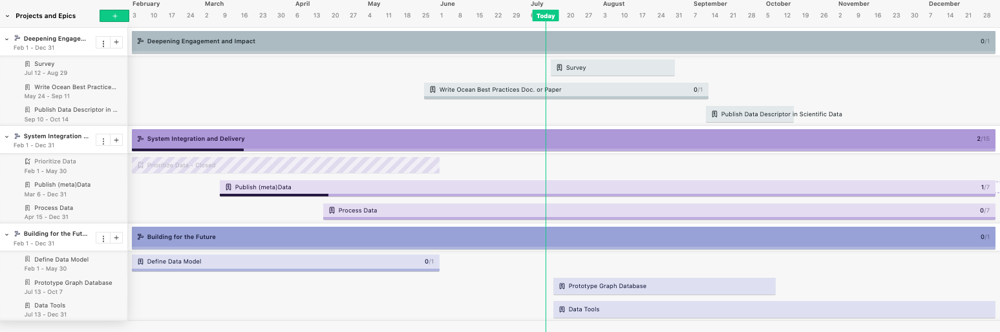

---
output:
  rmarkdown::pdf_document:
    
    fig_caption: yes
    includes:
      in_header: figure_opts.tex
    latex_engine: xelatex
sansfont: Times New Roman
fontsize: 12pt

header-includes:
- \usepackage{booktabs}
- \usepackage{sectsty} \sectionfont{\centering \emph}
---

```{r, include = FALSE}
knitr::opts_chunk$set(echo = FALSE, message = FALSE)
library(here)
library(tidyverse)
library(hakaiR)
options(scipen=999) # This removes scientific notation for inline output ie `r object` in the report text
```

# _International Year of the Salmon Data Mobilization Strategic Recommendations_

`Hakai Institute`

`Brett Johnson, Tim van der Stap`

`1713 Hyacinthe Bay Road, Heriot Bay, BC, Canada`

`Last Updated:` `r Sys.time()`

# Executive Summary

An agreement was signed between the Hakai Institute and the North Pacific Anadromous Fish Commission on February 3rd, 2020 for the Hakai Institute to scope and review the requirements of data management and data mobilization for salmon ecology and oceanographic observations collected by the International Year of the Salmon High Seas Research Expeditions in the North Pacific Ocean. Here, we recommend a number of actions and considerations for building and delivering cyberinfrastructure systems to integrate a keystone data ecosystem -- salmon ocean ecology data. Foremost we recommend timely, inclusive, and equitable data access under FAIR terms (Findable, Accessible, Interoperable, and Reusable). To that end, we recommend adopting the Global Ocean Observing System (GOOS) put forth by the United Nations Educational, Scientific and Cultural Organization. Adopting the best practices for ocean data management outlined broadly by UNESCO will ensure a multilateral approach to the integration, standardization, and distribution of salmon ocean ecology data. 

We recommend four components of a Data Mobilization Model: 1) Data catalogue records compliant with ISO 19115 (http://iys.hakai.org); 2) Open-Access licensing and Open Data Access Protocols; 3) Controlled Vocabularies that define the variables, methods, units, platforms and measurement types used in salmon ocean ecology; 4) A federated, dedicated, and trustworthy system of data repositories for hosting salmon ocean ecology data and data analysis tools securely in perpetuity. 

Data sets collected by the 2019 High Seas Expedition are centrally findable in an International Year of the Salmon Ocean Observing System (IYS-OOS) catalogue at https://iys.hakai.org. We've built and delivered the data catalogue infrastructure, including ISO 19115 geospatial-metadata-standard compliant data-catalogue-records, to facilitate mobilizing privately-funded data produced in 2019 and 2020 and for data produced in 2022 and beyond. We continue to facilitate data mobilization for historical data sets, including 2019 and 2020, but the onus has now shifted to project-associated Scientists, Principal Investigators, and their funders to determine how to best fit their (historical) data into the International Year of the Salmon Ocean Observing System. A major focus for ongoing data mobilization work is the automation of data handling procedures and the development of human-friendly data-management work flows, best-practices, and communication protocols. 

# Introduction

The North Pacific Anadromous Fish Commission (NPAFC) is implementing a five-year International Year of the Salmon (IYS) collaborative project through 2022 to set the conditions for the resilience of salmon and people in a rapidly changing world. Member nations of the NPAFC are collaborating on a multi-vessel Oceanographic Expedition planned for March 2022 covering from California North and West to Kamchatka, Russia and as far south as South Korea, including the Sea of Okhotsk and parts of the Bering Sea. Trans-disciplinary research spanning Physical, Biogeochemical, and Biology/Ecosystem domains from at least a dozen institutions and agencies will generate a complex set of data. Success will be measured by timely and equitable access to data and knowledge generated by these expeditions. The NPAFC and the Hakai Institute, with support from the British Columbia Salmon Restoration and Innovation Fund and the Tula Foundation, are conducting a review of current practices and new approaches to mobilizing salmon ocean ecology data, specifically for the data collected during the multi-vessel surveys planned for 2022.

# Methods

## Data Mobilization Model

For every data element, collection method, platform, and variable produced by the IYS High Seas Expeditions the following tasks need to be completed:  

1) Define. Determine whether the data element is already defined within the GOOS Essential Ocean Variable framework. For data elements that do not naturally belong in the GOOS EOV framework, determine how third-party definitions of data elements might be synonymous with GOOS EOVs. In cases where collected variables are not synonymous with GOOS compatible terms, determine whether there is a recognized and compatible repository where data belong and can be federated or linked to the IYS-OOS. Example alternative data repositories: Barcode of Life Database (BOLD), the Ocean Biodiversity Information System (OBIS), Global Biodiversity Information Facility (GBIF), DataONE, Federal Open Data, BC Government public data etc.)
2) Publish. For all data elements, generate appropriate and valid metadata records to make the existence of the data public knowledge and insert the records into the metadata catalogue on the IYS Data Portal, so that they are 'Findable' and 'Accessible' by IYS data users.
3) Transform and Integrate. Work with data providers to transform data copies, subsets, or aggregates of data elements so they can be integrated into appropriate repositories identified by domain expert scientists, making the data 'Interoperable'
4) Communicate. Implement flexible Data Mobilization and Communication Plans that can be adapted to the needs of specific science domains to facilitate data Re-use. 

## Project Management Model 

An executive-level steering committee will provide technical and strategic advice on the project while Hakai and the NPAFC will retain administrative oversight of the project. Steering Committee participants will include:

* Eric Peterson/Brett Johnson – Tula Foundation/Hakai Institute
* Mark Saunders/Stephanie Taylor/Caroline Graham – IYS/NPAFC
* Bruce Patten – DFO Pacific Biological Station and OBIS Canada Node Manager
* Gabrielle Canonico - GOOS BioEco Panel Co-Chair & NOAA Federal
* Evgeny Pakhomov - IYS Chief Scientist, Professor and Director UBC Institute of Oceans and Fisheries
* Dick Beamish and Brian Riddell – 2019 and 2020 Expedition Organizers
* National Lead Scientists for the IYS

For the 2022 expeditions to be successful, Data Mobilization and Communication Plans should be developed with each National Lead Scientist to develop and clarify the expectations related to data management. This approach should then be shared with Expedition Scientists in each Research Area of the High Seas Expeditions, with involvement spanning multiple nations. This should be done well in advance of the expeditions to identify every data element, method, platform, and variable they plan to collect as well as identify benchmarks of data mobility to aim for. 

## Science Model

GOOS provides a framework for globally integrated and sustained ocean observing. Some of the core objectives of the GOOS are, among others, to set the global standards and best practices for ocean-related data collection, content curation, and mobilization. Through this scaffolding, data are regularly evaluated, and open data sharing is encouraged. Research Areas defined by the IYS should be mapped to the following GOOS science domains that reflect the Essential Ocean Variable (EOV) schema.

The following list indicates the relevant GOOS domains and three example EOVs that IYS expedition participants ought to consider when defining their science model. Within each domain, EOVs should be mapped to the variables that will be collected by IYS scientists where applicable.

* [Physics and Climate](https://www.goosocean.org/index.php?option=com_content&view=article&id=124&Itemid=281)
  * Sea state
  * Ocean surface stress
  * Sea ice

* [BioGeoChemical](https://www.goosocean.org/index.php?option=com_content&view=article&id=80&Itemid=275)
  * Oxygen
  * Nutrients
  * Inorganic Carbon

* [Biology and Ecosystem](https://www.goosocean.org/index.php?option=com_content&view=article&id=79&Itemid=273)
  * Phytoplankton biomass and diversity
  *	Zooplankton biomass and diversity
  * Fish abundance and distribution
  
## Communication Model 

A communication model will need to be developed that demonstrates how the Data Mobilization Model will be communicated to the National Lead Scientists, the principal investigators and the Expedition Scientists. Furthermore, public outreach is essential to build interest within the scientific community, ensuring adoption of best practices and technologies related to salmon ocean ecology, connecting and engaging stakeholders and partner organizations, and deepening the impact of the IYS High Seas Expeditions. To engage with scientific peers and ensure longevity of the approach adopted, we recommend documenting the Data Mobilization Model for salmon ocean ecology into best practices to be included in the Ocean Best Practices System (OBPS). Additionally, a model or framework will need to be established on how best to communicate the IYS salmon ocean ecology data collected, the adopted data mobilization approach, and technologies used to the general public.

# Timeline

Throughout the Data Mobilization Model, three themes determine the time line: 1) Deepening Engagement and Impact; 2) System Integration and Delivery; and 3) Building for the Future (see Figure 1). The progress made in each of the themes is divided into three phases. In Phase 1, a roadmap is created for each of the themes, identifying the goals and scoping the requirements needed to accomplish these. In Phase 2, we conceptualize the goals set in Phase 1 and create and communicate a workflow for IYS Expedition Scientists to standardize, mobilize and integrate their data under the CIOOS and GOOS umbrella. In Phase 3, we aim to cement the legacy of the IYS High Seas Expeditions, e.g. through integration of the data collected during the IYS Expeditions within the GOOS framework, documentation of this data integration and mobilization workflow, highlighting and documenting ocean best practices related to the collection of salmon ocean ecology data, and communicating the data collected and data mobilization approach taken to the scientific community and general public.  

This report is intended to wrap up Phase 1 and lay the foundation for Phase 2. In Phase 2 we aim to create a Data Mobilization and Communication plan specific to each IYS Research Area, further outlining the workflow and communicating this to the IYS Expedition Scientists to deepen their engagement and impact. Historic data collected during the 2019 and 2020 IYS High Seas Expeditions can be used to further inform and improve the workflow for data collection, methodologies, recording and integration. Creating a standardized workflow for each specific IYS science group will improve the outcome for Phase 3, where we intend to facilitate integration the data collected within the GOOS framework and to document the best practices related to salmon ocean ecology and each IYS science group. We further intend to communicate the approach taken to a global scientific community and general public, thereby deepening the impact of the research done under the IYS project and increasing its range. 

Currently we are publishing metadata and data sets provided by the 2019 and 2020 Scientists to the private IYS Data Catalogue, and documenting roadblocks in the data mobilization process. Additionally, we are standardizing 2019 and 2020 data sets to international standards and hosting it in appropriate repositories to demonstrate the workflow.



Figure 1. Data strategy road map through 2022

## Next steps

Despite the challenges we face because of the uncertainty created by the COVID-19 pandemic, we will remain focused on preparing for some form of coordinated research expeditions occurring in 2022.

* Continue to publish data sets provided by the 2019 and 2020 Scientists to the IYS Data Catalogue (https://iys.hakai.org).

* Transform and integrate 2019 and 2020 data sets to international standards and host data on appropriate repositories to demonstrate, only in novel examples/domains, how to achieve international integration.

* Facilitate Data Mobilization and Communication plans for each IYS science group well in advance of 2022 Expeditions.

* Engineer research software starting with a GOOS-compatible technology kernel to facilitate programmatic data access, quality checks, visualization, and other common data analysis functions.

## Known Challenges

Across each IYS Research Area, documentation of sensor or instrument calibration, collection protocols, sample processing protocols, data exchange protocols, and sample shipping and tracking protocols is critical. This includes equipment and platform descriptions, calibration files, instructions for how data were summarized or aggregated, and any caveats for data interpretation. This will help ensure the scientific integrity of the consolidated data sets. Dataset 'Quality' levels will eventually be assigned based on completeness of metadata collection and integrity of data provenance. Translators with domain specific knowledge of the data need to be identified in advance of data collection and integration. Development of best practices among research domains is pressing.

Access to raw outputs and the detailed processing steps that occur to transform data are needed for complete data provenance. Keeping track of changes to raw data will help us ensure reproducibility, which is becoming commonly required in life sciences journals. Using a change log to manually document changes to the raw data ensures that reproducibility can be achieved when data cleaning is performed ad hoc. Otherwise, we recommend moving towards automated version control, scripted data transformations and agreed upon controlled vocabularies and metadata profiles that canonically define variables. This will help scientists collaborate on common data sets and analyses using modern cyber-infrastructure that is already developed but require operational agreements to effectively implement.

# Links and Resources

* [IYS-OOS GitHub Repository](https://github.com/HakaiInstitute/iys-oos)
* [IYS Data Catalogue](https://iys.hakai.org)
* [Global Ocean Observing System](https://www.goosocean.org/)

Contact us at iys.data@hakai.org for questions, comments, or data inquiries.

