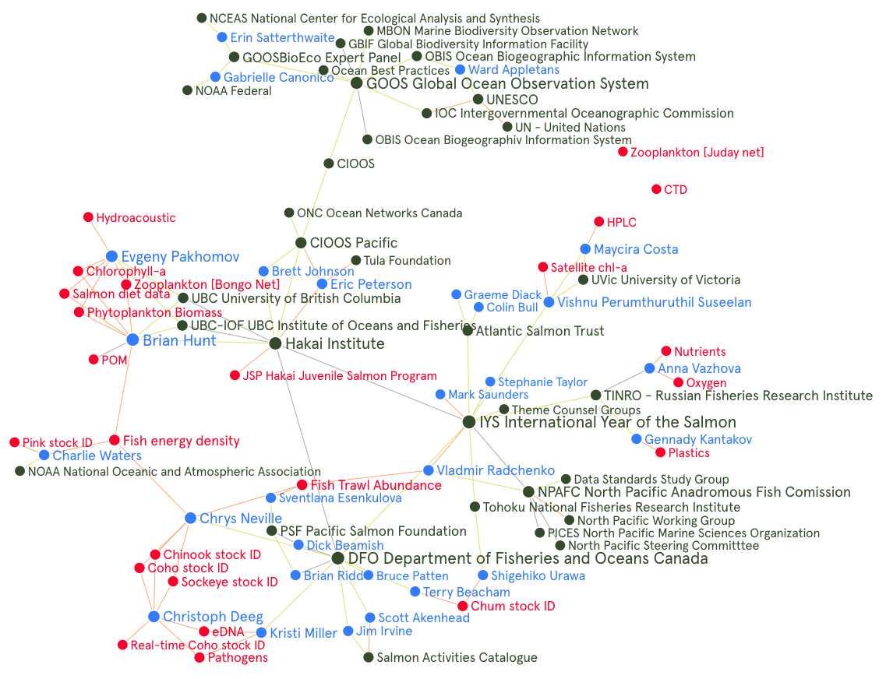

---
output:
  rmarkdown::pdf_document:
    
    fig_caption: yes
    includes:
      in_header: figure_opts.tex
    latex_engine: xelatex
sansfont: Times New Roman
fontsize: 12pt

header-includes:
- \usepackage{booktabs}
- \usepackage{sectsty} \sectionfont{\centering \emph}
      
---

```{r, include = FALSE}
knitr::opts_chunk$set(echo = FALSE, message = FALSE)
library(here)
library(tidyverse)
library(hakaiR)
options(scipen=999) # This removes scientific notation for inline output ie `r object` in the report text
```

# _International Year of the Salmon Data Mobilization Interim Report_

`March 31, 2020`

`Brett Johnson, Eric Peterson, Ray Brunsting`

`Hakai Institute`

`1713 Hyacinthe Bay Road, Heriot Bay, BC, Canada`

# Executive Summary

An agreement was signed between the Hakai Institute and the North Pacific Anadromous Fish Commission on February 3rd, 2020 for Hakai to scope and review the requirements of data management for data collected by the International Year of the Salmon high seas research expeditions in the North Pacific. We recommend that the International Year of the Salmon collaborative project adopt, implement, and extend the Global Ocean Observation System for measuring Essential Ocean Variables. The Global Ocean Observation System is a project of the United Nation’s Intergovernmental Oceanographic Commission and unifies networks of scientists around the world. Adopting international standards such as the Ocean Biogeographic Information System, and FAIR (Findable, Accessible, Interoperable, Reusable) Data principles that are widely recognized will ensure a multilateral approach to the standardization of salmon ocean ecology data. 

Data collected by the 2019 research cruise is centrally accessible in an International Year of the Salmon Ocean Observation System (IYS-OOS) catalogues at https://iys.hakai.org. We provide a complete catalogue of the data sets produced by the IYS in 2019 with ISO 19115 compliant metadata records which makes these data openly discoverable.

The core components of the Data Management and Communications model are:  1) Data catalogue records compliant with ISO 19115 (http://iys.hakai.org); 2) Open-Access licensing and Open Data Access Protocols (ERDDAP); 3) Controlled Vocabularies that define the variables, methods, units, platforms and measurement types used in salmon ocean ecology adhering to ‘Ocean Best Practices’ maintained by the Global Ocean Observation System; 4) A dedicated digital repository for ongoing data-analysis-tool development. 

# Introduction

The North Pacific Anadromous Fish Commission (NPAFC) is implementing a five-year International Year of the Salmon (IYS) collaborative project through 2022 to set the conditions for the resilience of salmon and people in a rapidly changing world. Partners are collaborating for a Pan-Pacific Expedition in March 2021 with up to five vessels simultaneously surveying the North Pacific. Multi-disciplinary programs across at least a dozen institutions and agencies will generate a complex set of data in the 2021 surveys.  Success will ultimately demand that standardized and integrated data are available to researchers involved in the work at sea and those who will work with it into the future. It is important that these data are open, readily accessible to all, and comply with the principles of FAIR data.  The NPAFC and the Hakai Institute with support from the BC Salmon Restoration and Innovation Fund and the Tula Foundation are conducting a review of approaches to data standardization and acquisition to support the communucation of standards available, data storage, and data analysis collected during the five-vessel survey. Brett Johnson will serve as the Technical Lead under direction from a Steering Committee and lead a small development team based at the Hakai Institute Quadra Island Ecological Observatory. The objective of this work is to catalogue expedition data, provide a guide to mobilize IYS data and innovate a Data Management and Communications model in salmon ocean ecology.

# Data Management and Communications Model

The model will be founded on protocols and standards for archiving and providing open access to data put forward by the Global Ocean Observation System (GOOS). GOOS is a program that is coordinated by the Intergovernmental Oceanographic Commission of UNESCO (United Nations Educational, Scientific and Cultural Organization). GOOS is governed by a multinational Steering Committee, three scientific domain Expert Panels, and Observation Coordination Groups of people and organizations worldwide. GOOS is partnered with expert agencies in biological data—namely the Ocean Biogeographic Information System (OBIS), Biodiversity of Life Online Database (BOLD) and the Marine Biodiversity Observation Network (MBON), among others. These organizations promote and/or develop the use of Controlled Vocabularies. Standards like this encourage interoperability and reuse of data. We recommend using established international standards connected to GOOS where available, and extending or developing standards where needed. The product of this strategic alignment and development we can call the International Year of the Salmon Ocean Observation System (IYS-OOS) for now.

For every data element, method, platform, and variable produced by the IYS High Seas Expeditions the following tasks need to be completed:  

TODO: re-frame for IYS 2021 participants

* Prioritize. Determine whether the data element naturally belongs in IYS-OOS (with possible GOOS BioEco extensions). Such elements will be processed first because the requirements are well-defined. For data elements that do not naturally belong in IYS-OOS, determine whether there is a recognized and compatible repository where they belong and can be federated or linked to the IYS-OOS.
* Publish. For all data elements, generate appropriate and valid metadata records and insert them into the metadata catalogue on the IYS Data Portal, so that they are discoverable by IYS users.
* Process. Work closely with the data provider to bring fully validated and standardized copies of data elements into the appropriate repositories.
* Communicate. Representatives from each scientific discipline involved with the IYS should connect through a working group that disseminates and advocates for best-practices.

For the 2021 cruise to be successful, the establishment of a data standards science team made up of relevant representation of stakeholders needs to be established as soon as possible to begin to prioritize every data element, method, platform, and variable they plan to collect.


# Data Strategy

Beyond the recommendation of technical infrastructure and standards, there needs to be a long-term strategy that effectively engages important stakeholders and deepens the impact of data mobilization. This should be a primary focus of, but not limited to, the first phase of the IYS-OOS. Strategic objectives could be modelled after the GOOS 2030 strategy and include 1) Deepening Engagement and Impact; 2) System Integration and Delivery; and 3) Building for the Future.

## Targetted Systems Change

2 or 3 paras here

## Avoiding Information Colonialism

Most agree that Open Science, FAIR data in TRUSTed repository are noble notions in a time of great inequality.
FAIR trade: How products were made and the patterns of our consumption. We need a guide for social action to make informed decisions. 

The history of colonialism caused indigenous cultural materials to now be predominantly owned by third parties or left out of reach in the public domain. Stewardship and reconciliation is not possible under the current legaices of exploitation appropriation. TK labels are a guide for social action.

Use knowledge for art, for knowledhe, to represent the world around us. Copyright is granted to someone who makes things with knowledge.

Copyright originally define who did and did not have certain rights to reporoduce. We therefore have to be extremely careful in terms of providing the power of reproducibility. Digital objects are the same as books.

Focus on returning museum archive materials to source communities, but legal status... people in photos have no special rights or access, regardless of content. Knowledge handed down from generations should have no author identified. Collab and collective materials same thing as before.

Ownership and authorship doesn't always fit with how indigineous cultura materials wer made or can be accessed. But FN need to be able to manage those materials. TK licenses with different access and use expectations.

Knowledge is power.

TK licesens ask pple to respect their indigenous protocols and laws that govern their culutral heritage materials. Some materials are senstii e have restrictions and are not free to be used by anyone at anytime.

## Steering Committee 

An executive-level steering committee will provide technical and strategic advice on the project while Hakai and NPAFC will retain administrative oversight of the project. Steering Committee participants will include:

* Eric Peterson/Brett Johnson – Hakai Institute
* Mark Saunders/Stephanie Taylor– NPAFC
* Dick Beamish and Brian Riddell – 2019 and 2020 Expeditions/Pacific Salmon Foundation
* Bruce Patten – DFO Pacific Biological Station and OBIS Canada Node Manager
* Erin Satterthwaite – GOOS BioEco Expert Panel Member
* Brian Hunt – University of British Columbia Institute of Oceans and Fisheries, Expedition Scientist
* Expedition Chief Scientists 

## Development Groups

The development of the data model will rely heavily on input from expedition scientists, project affiliated Scientists, Professors, and others. Within each scientific domain planned for the 2021 cruise, there should be representation in an ad hoc working group tasked with determining international data standards that apply to their domain of expertise

Hakai Staff and affiliates to consult as needed:

* Eric Peterson. Strategic direction.
* Ray Brunsting. Hakai Chief Technology Officer.
* Matt Foster. Hakai Chief Data Architect. 
* Jennifer Jackson. Physical oceanographer for Hakai.
* Brian Hunt. A faculty member at UBC and the head of Hakai salmon program



```{r, network, eval = FALSE}
library(networkD3)

# read graph commons data
nodes <- read_csv(here("data", "IYS-OOS-nodes.csv")) %>% 
  select(name = Name,
         group = Type,
         size = 1:length(ncol)) %>% 
  arrange(name)

nodes$node_id <- as.factor(nodes$name)
nodes$node_id <- as.numeric(nodes$node_id)
nodes$node_id <- nodes$node_id - 1 # zero index source and target

nodes <- nodes %>% 
  select(-size)

links <- read_csv(here("data", "IYS-OOS-edges.csv")) %>% 
  select(source = "From Name",
         target = "To Name",
         value = Weight)

source <- inner_join(links, nodes, by = c("source" = "name")) %>% 
  select(source = node_id)

target <- inner_join(links, nodes, by = c("target" = "name")) %>% 
  select(target = node_id)

source$source <- as.factor(source$source)
target$target <- as.factor(target$target)
links <- data.frame(source$source, target$target)

links$source <- links$source.source
links$target <- links$target.target

links <- links %>% 
  select(source, target)

nodes <- data.frame(nodes)

forceNetwork(Links = links, Nodes = nodes,
             Source = "source", Target = "target",
             NodeID = "name",
             Group = "group", opacity = 1,
             opacityNoHover = 1, fontSize = 12, 
             zoom = TRUE, legend = TRUE, bounded = FALSE)

```

# Timeline for 2021 Expeditions

Here is the proposed road map and timeline which will be refined before finalization for May 30, 2020.

TODO: Update with Release report, backlog report, and sprint backlog.

* Produce a comprehensive Data Strategy May 30, 2020
* Begin Building Data Management and Communication Model	June 1, 2020
* Establish 2021 cruise Data Standards Group ASAP
* Bring 2019 Cruise Data into the Correct Repository(s) August 2020
* Bring 2020 Cruise Data into the Correct Repository(s)	September	2020
* Identify leaders for 2021 Cruise Data Management	ASAP	2020
* Integrate 2019, 2020, and 2021 cruise data	TBD	2021
* Extend GOOS framework into Salmon Ocean Ecology and Integrate with Salmon Activities Catalogue	TBD	2021

# Time Sensitive Challenges

Some methods used in the field need better documentation in the metadata associated with each dataset produced on the expedition. This includes equipment and platform descriptions,  calibration files, instructions for how data were summarized or aggregated, and any caveats for data interpretation etc... This will help in ensuring the scientific integrity of the consolidated data sets. Dataset 'Quality' levels will eventually be assigned based on completeness of metadata collection and integrity of provenance. Development of these guidelines among research domains is pressing.

Trawl catch data has not yet been received. My current understanding indicates that the  dataset structure is under development, and that expedition Scientists are working on this. Please understand that access to raw outputs and the detailed processing steps that occur to transform data are needed for complete data provenance. Keeping track of changes to raw data will help us ensure reproducibility, which is becoming commonly required in life sciences journals despite it being a high bar to aim for. Using a change log that you maintain manually ensures that reproducibility can be achieved when data cleaning is performed ad hoc such as removing outliers during quality control procedures, etc. Otherwise, we recommend moving to using scripted data transformations and distributed version control to help scientists collaborate on common data and analyses.

There are also a number of questions we have related to specific data sets that we keep track of [here](https://github.com/HakaiInstitute/iys-oos/issues) for data providers to view and respond to. We recommend the ad hoc development of data standards group ASAP. A core group comprised of representatives of each research domain (physical oceanography, salmon feeding ecology etc.) and representation from as many member nations, and stakeholders as feasible. 

# Next Steps

### Produce a Data Strategy Document that will:

* Identify project milestones for 2020, 2021, and 2022 and requisite steps to success
* Describe the foundation for a new best-practice approach to provide open and FAIR access to salmon, oceanographic, and climatic data integrated from numerous sources.
* Propose a survey of key data providers to deepen engagement.

### Begin Building Data Management & Communication Framework

Start building a data management and communication framework that initially comprises:

* A web-based IYS Data Portal. We propose to follow the lead of DFO/CIOOS and implement a cloud-based solution with Amazon Web Services, utilizing the Montreal data centre to host a data catalogue/portal.

* A metadata catalogue (we propose to follow DFO/CIOOS and employ CKAN), which allows for data discovery across the federated system.

* A GOOS-compatible repository for physical and biogeochemical data acquired on the expeditions.

* Solutions for other data types: either as natural extensions of the GOOS model, as contemplated under the GOOS Bio Eco, or in other repositories, as mandated by our modelling decisions.

* Concentrate first on the data types acquired during the 2019 cruise.

# Links and Resources

* [IYS-OOS GitHub Repository](https://github.com/HakaiInstitute/iys-oos)
* [Please comment on this document issues in github](https://github.com/HakaiInstitute/iys-oos/issues)
* [Temporary 'AirTable' IYS-OOS Database](https://airtable.com/invite/l?inviteId=invsmpqvzHUggckwg&inviteToken=53431b316c148356785d2c470a1605bc91103f8fe8189250563d929747ca2124)
* [Template CKAN Catalogue](https://catalogue.cioospacific.ca/)
* [Global Ocean Observation System](https://www.goosocean.org/)
* [OBIS ENV-DATA Darwin Core Archive Data Structure](https://obis.org/manual/dataformat/)
* [Good enough practices in scientific computing](https://doi.org/10.1371/journal.pcbi.1005510)

